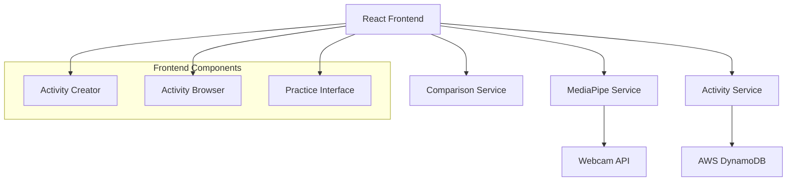

# Design Document

## Overview

The Activity System is built around Google's MediaPipe Pose Landmark Detection library, providing real-time pose tracking and comparison capabilities. The system consists of two main user flows: trainers creating activities through pose recording, and trainees practicing these activities with real-time feedback. The architecture leverages React with TanStack Router for the frontend, MediaPipe for pose detection, and AWS DynamoDB for data persistence.

## Architecture

### High-Level Architecture



### Component Architecture

The system follows a modular architecture with clear separation of concerns:

- **Presentation Layer**: React components for UI interactions
- **Service Layer**: Business logic for pose detection, activity management, and comparison
- **Data Layer**: AWS DynamoDB for persistent storage
- **External APIs**: MediaPipe for pose detection, Webcam API for video capture

## Components and Interfaces

### 1. MediaPipe Service

**Purpose**: Handles all pose detection functionality using MediaPipe PoseLandmarker

**Key Methods**:

```typescript
interface MediaPipeService {
  initializePoseLandmarker(): Promise<PoseLandmarker>;
  detectPoseFromVideo(video: HTMLVideoElement): Promise<PoseLandmarkerResult>;
  detectSinglePose(video: HTMLVideoElement): Promise<PoseLandmarkerResult>;
  extractLandmarks(result: PoseLandmarkerResult): PoseLandmark[];
}
```

**Implementation Details**:

- Uses `PoseLandmarker.createFromOptions()` with model configuration
- Implements `detectForVideo()` for continuous tracking during moves
- Handles model loading and initialization errors
- Manages video frame processing and timing

### 2. Activity Service

**Purpose**: Manages activity creation, storage, and retrieval

**Key Methods**:

```typescript
interface ActivityService {
  createPoseActivity(
    landmarks: PoseLandmark[],
    metadata: ActivityMetadata
  ): Promise<string>;
  createMovementActivity(
    landmarkSequence: TimestampedLandmarks[],
    metadata: ActivityMetadata
  ): Promise<string>;
  getActivities(): Promise<Activity[]>;
  getActivityById(id: string): Promise<Activity>;
  saveActivity(activity: Activity): Promise<void>;
}
```

**Data Structures**:

```typescript
interface Activity {
  id: string;
  type: "pose" | "movement";
  name: string;
  createdBy: string;
  createdAt: Date;
  modifiedAt: Date;
  duration?: number;
  landmarks: PoseLandmark[] | TimestampedLandmarks[];
}

interface TimestampedLandmarks {
  timestamp: number;
  landmarks: PoseLandmark[];
}
```

### 3. Comparison Service

**Purpose**: Compares trainee poses against recorded activities with configurable thresholds

**Key Methods**:

```typescript
interface ComparisonService {
  comparePoses(
    recorded: PoseLandmark[],
    current: PoseLandmark[],
    difficulty: DifficultyLevel
  ): ComparisonResult;
  compareMovementSequence(
    recorded: TimestampedLandmarks[],
    current: TimestampedLandmarks[],
    difficulty: DifficultyLevel
  ): ComparisonResult;
  calculateSimilarityScore(
    pose1: PoseLandmark[],
    pose2: PoseLandmark[]
  ): number;
}

interface ComparisonResult {
  isMatch: boolean;
  score: number;
  feedback: string[];
  suggestions: string[];
}
```

**Threshold Configuration**:

- Soft: 0.7 similarity threshold
- Medium: 0.8 similarity threshold
- Hard: 0.9 similarity threshold

### 4. Webcam Service

**Purpose**: Manages webcam access and video stream handling

**Key Methods**:

```typescript
interface WebcamService {
  requestCameraAccess(): Promise<MediaStream>;
  startVideoStream(videoElement: HTMLVideoElement): Promise<void>;
  stopVideoStream(): void;
  checkCameraPermissions(): Promise<boolean>;
}
```

### 5. React Components

#### ActivityCreator Component

- Handles trainer interface for creating activities
- Manages recording state and duration timers
- Integrates with MediaPipe and Activity services
- Provides visual feedback during recording

#### ActivityBrowser Component

- Displays available activities in a grid/list format
- Filters activities by type and difficulty
- Handles activity selection and navigation to practice mode

#### PracticeInterface Component

- Main interface for trainees attempting activities
- Real-time pose comparison and feedback display
- Progress tracking and performance metrics
- Difficulty level selection

#### WebcamPreview Component

- Reusable component for video display
- Overlay for pose landmarks visualization
- Recording indicators and status messages

## Data Models

### DynamoDB Schema

**Activities Table**:

```typescript
interface ActivityRecord {
  PK: string; // "ACTIVITY#${activityId}"
  SK: string; // "METADATA"
  GSI1PK: string; // "ACTIVITIES"
  GSI1SK: string; // "${createdAt}#${activityId}"

  id: string;
  type: "pose" | "movement";
  name: string;
  createdBy: string;
  createdAt: string;
  duration?: number;
  isPublic: boolean;
}
```

**Activity Data Table**:

```typescript
interface ActivityDataRecord {
  PK: string; // "ACTIVITY#${activityId}"
  SK: string; // "DATA#${timestamp}" or "DATA#POSE"

  landmarks: PoseLandmark[];
  timestamp?: number;
}
```

### MediaPipe Data Structures

```typescript
interface PoseLandmark {
  x: number;
  y: number;
  z: number;
  visibility?: number;
}

interface PoseLandmarkerResult {
  landmarks: PoseLandmark[][];
  worldLandmarks: PoseLandmark[][];
  segmentationMasks?: ImageData[];
}
```

## Error Handling

### Camera Access Errors

- Handle permission denied scenarios
- Provide fallback UI when camera unavailable
- Clear error messages and retry mechanisms

### MediaPipe Initialization Errors

- Model loading failures with retry logic
- Graceful degradation when pose detection fails
- Performance monitoring and optimization

### Database Errors

- Connection failures with exponential backoff
- Data validation before saving
- Conflict resolution for concurrent operations

### Real-time Processing Errors

- Frame processing failures with recovery
- Memory management for continuous tracking
- Performance optimization for smooth experience

## Testing Strategy

### Unit Testing

- MediaPipe service methods with mock video data
- Comparison algorithms with known pose data
- Activity service CRUD operations
- Component rendering and user interactions

### Integration Testing

- End-to-end activity creation workflow
- Real-time pose comparison accuracy
- Database operations with test data
- Camera integration with mock streams

### Performance Testing

- Frame processing speed and consistency
- Memory usage during extended sessions
- Database query performance
- Real-time comparison latency

### User Acceptance Testing

- Trainer workflow for activity creation
- Trainee experience with different difficulty levels
- Cross-browser compatibility
- Mobile device responsiveness

## Security Considerations

### Data Privacy

- Pose landmark data anonymization
- Secure transmission to DynamoDB
- User consent for camera access
- Activity visibility controls

### Authentication

- Trainer authentication for activity creation
- Session management and token handling
- Role-based access control

### Input Validation

- Pose data validation before storage
- Activity metadata sanitization
- File upload restrictions and scanning
