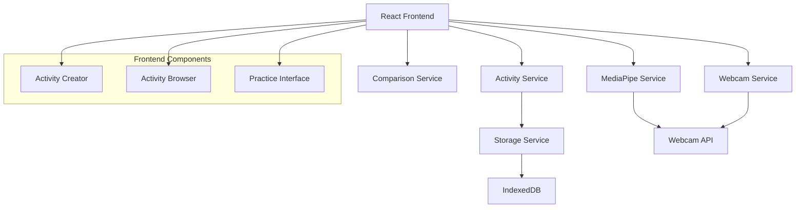

# Design Document

## Overview

The Activity System is built around Google's MediaPipe Pose Landmark Detection library, providing real-time pose tracking and comparison capabilities. The system consists of two main user flows: trainers creating activities through pose recording, and trainees practicing these activities with real-time feedback. The architecture leverages React with TanStack Router for the frontend, MediaPipe for pose detection, and AWS DynamoDB for data persistence.

## Architecture

### High-Level Architecture


```mermaid
graph TB
    A[React Frontend] --> B[MediaPipe Service]
    A --> C[Activity Service]
    A --> D[Comparison Service]
    A --> E[Webcam Service]
    C --> F[Storage Service]
    F --> G[IndexedDB]
    B --> H[Webcam API]
    E --> H

    subgraph "Frontend Components"
        I[Activity Creator]
        J[Activity Browser]
        K[Practice Interface]
    end

    A --> I
    A --> J
    A --> K
```

### Component Architecture

The system follows a modular architecture with clear separation of concerns:

- **Presentation Layer**: React components for UI interactions
- **Service Layer**: Business logic for pose detection, activity management, and comparison
- **Data Layer**: Browser IndexedDB for local persistent storage via StorageService
- **External APIs**: MediaPipe for pose detection, Webcam API for video capture

### Storage Architecture

The system uses browser-based local storage (IndexedDB) instead of cloud storage:

- **Benefits**: No backend infrastructure, instant access, offline capability, no API costs
- **Limitations**: Data is device-specific, limited by browser storage quota, cleared with browser data
- **Implementation**: StorageService wraps IndexedDB operations with async/await interface
- **Data Structure**: Activities stored with metadata, landmarks, and base64-encoded images

## Components and Interfaces

### 1. MediaPipe Service

**Purpose**: Handles all pose detection functionality using MediaPipe PoseLandmarker

**Key Methods**:

```typescript
interface MediaPipeService {
  initializePoseLandmarker(): Promise<PoseLandmarker>;
  detectPoseFromVideo(video: HTMLVideoElement): Promise<PoseLandmarkerResult>;
  detectSinglePose(video: HTMLVideoElement): Promise<PoseLandmarkerResult>;
  extractLandmarks(result: PoseLandmarkerResult): PoseLandmark[];
}
```

**Implementation Details**:

- Uses `PoseLandmarker.createFromOptions()` with model configuration
- Implements `detectForVideo()` for continuous tracking during moves
- Handles model loading and initialization errors
- Manages video frame processing and timing

### 2. Activity Service

**Purpose**: Manages activity creation, storage, and retrieval using local browser storage

**Key Methods**:

```typescript
interface ActivityService {
  createPoseActivity(
    landmarks: PoseLandmark[],
    imageData: string,
    metadata: ActivityMetadata
  ): Promise<string>;
  createMovementActivity(
    landmarkSequence: TimestampedLandmarks[],
    metadata: ActivityMetadata
  ): Promise<string>;
  getActivities(): Promise<Activity[]>;
  getActivityById(id: string): Promise<Activity | null>;
  deleteActivity(id: string): Promise<void>;
}
```

**Storage Integration**:

- Uses StorageService for IndexedDB operations
- Stores activity metadata, pose landmarks, and captured images
- Handles storage quota errors gracefully
- Provides activity deletion for storage management

**Data Structures**:

```typescript
interface Activity {
  id: string;
  type: "pose" | "movement";
  name: string;
  createdBy: string;
  createdAt: Date;
  isPublic: boolean;
  duration?: number;
  imageData?: string; // Base64-encoded image for pose activities
  landmarks?: PoseLandmark[]; // For pose activities
  poseData?: PoseLandmark[]; // Alternative storage for pose data
  movementData?: TimestampedLandmarks[]; // For movement activities
}

interface TimestampedLandmarks {
  timestamp: number;
  landmarks: PoseLandmark[];
}
```

### 3. Comparison Service

**Purpose**: Compares trainee poses against recorded activities with configurable thresholds

**Key Methods**:

```typescript
interface ComparisonService {
  comparePoses(
    recorded: PoseLandmark[],
    current: PoseLandmark[],
    difficulty: DifficultyLevel
  ): ComparisonResult;
  compareMovementSequence(
    recorded: TimestampedLandmarks[],
    current: TimestampedLandmarks[],
    difficulty: DifficultyLevel
  ): ComparisonResult;
  calculateSimilarityScore(
    pose1: PoseLandmark[],
    pose2: PoseLandmark[]
  ): number;
}

interface ComparisonResult {
  isMatch: boolean;
  score: number;
  feedback: string[];
  suggestions: string[];
}
```

**Threshold Configuration**:

- Soft: 0.7 similarity threshold
- Medium: 0.8 similarity threshold
- Hard: 0.9 similarity threshold

### 4. Webcam Service

**Purpose**: Manages webcam access and video stream handling

**Key Methods**:

```typescript
interface WebcamService {
  requestCameraAccess(): Promise<MediaStream>;
  startVideoStream(videoElement: HTMLVideoElement): Promise<void>;
  stopVideoStream(): void;
  checkCameraPermissions(): Promise<boolean>;
}
```

### 5. React Components

#### ActivityCreator Component

**Recording States**:
- `idle`: Initial state, camera off
- `preparing`: Camera activation in progress
- `countdown`: 3-2-1 countdown before capture
- `capturing`: Brief moment when pose is captured
- `reviewing`: Showing captured pose for approval
- `processing`: Saving activity to storage
- `completed`: Activity successfully created

**Key Features**:
- Manual camera toggle to conserve resources
- Configurable countdown delay (3 seconds default)
- Image capture from video frame (non-mirrored)
- Pose review with approve/retake options
- Automatic camera shutdown after completion
- Visual feedback during all recording stages

#### ActivityBrowser Component

- Displays available activities in a grid/list format
- Filters activities by type and difficulty
- Handles activity selection and navigation to practice mode

#### PracticeInterface Component

**Key Features**:
- Difficulty level selection: Soft (Easy), Medium, Hard
- "Test Camera" button for verifying pose detection setup
- Video dimension validation before starting practice
- Real-time pose comparison and feedback display
- Progress tracking and performance metrics
- Session statistics (attempts, matches, best score)
- Automatic error handling for invalid video streams

**Camera Test Mode**:
- 30-second test duration
- Real-time pose landmark visualization
- Allows users to verify camera setup before practice
- Can be stopped at any time
- Provides feedback on pose detection quality

#### WebcamPreview Component

- Reusable component for video display
- Overlay for pose landmarks visualization
- Recording indicators and status messages

## Data Models

### IndexedDB Schema

**Activities Object Store**:

```typescript
interface StoredActivity {
  id: string; // Primary key
  type: "pose" | "movement";
  name: string;
  createdBy: string;
  createdAt: Date;
  isPublic: boolean;
  duration?: number;
  imageData?: string; // Base64-encoded JPEG image
  landmarks?: PoseLandmark[]; // For pose activities
  poseData?: PoseLandmark[]; // Alternative storage
  movementData?: TimestampedLandmarks[]; // For movement activities
}
```

**Storage Service Interface**:

```typescript
interface StorageService {
  saveActivity(activity: Activity): Promise<void>;
  getActivity(id: string): Promise<Activity | null>;
  getAllActivities(): Promise<Activity[]>;
  deleteActivity(id: string): Promise<void>;
  clearAllActivities(): Promise<void>;
}
```

**Storage Considerations**:

- IndexedDB provides ~50MB+ storage per origin (browser-dependent)
- Images stored as base64 JPEG with 95% quality
- Automatic cleanup of old activities when quota exceeded
- Data persists until browser cache is cleared

### MediaPipe Data Structures

```typescript
interface PoseLandmark {
  x: number;
  y: number;
  z: number;
  visibility?: number;
}

interface PoseLandmarkerResult {
  landmarks: PoseLandmark[][];
  worldLandmarks: PoseLandmark[][];
  segmentationMasks?: ImageData[];
}
```

## Error Handling

### Camera Access Errors

- Handle permission denied scenarios
- Provide fallback UI when camera unavailable
- Clear error messages and retry mechanisms

### MediaPipe Initialization Errors

- Model loading failures with retry logic
- Graceful degradation when pose detection fails
- Performance monitoring and optimization

### Storage Errors

- IndexedDB quota exceeded handling
- Data validation before saving
- Graceful degradation when storage unavailable
- User notification for storage limitations

### Real-time Processing Errors

- Frame processing failures with recovery
- Video dimension validation before pose detection
- MediaPipe ROI (Region of Interest) error prevention
- Memory management for continuous tracking
- Performance optimization for smooth experience

## Testing Strategy

### Unit Testing

- MediaPipe service methods with mock video data
- Comparison algorithms with known pose data
- Activity service CRUD operations
- Component rendering and user interactions

### Integration Testing

- End-to-end activity creation workflow
- Real-time pose comparison accuracy
- Database operations with test data
- Camera integration with mock streams

### Performance Testing

- Frame processing speed and consistency
- Memory usage during extended sessions
- Database query performance
- Real-time comparison latency

### User Acceptance Testing

- Trainer workflow for activity creation
- Trainee experience with different difficulty levels
- Cross-browser compatibility
- Mobile device responsiveness

## Security Considerations

### Data Privacy

- Pose landmark data anonymization
- Secure transmission to DynamoDB
- User consent for camera access
- Activity visibility controls

### Authentication

- Trainer authentication for activity creation
- Session management and token handling
- Role-based access control

### Input Validation

- Pose data validation before storage
- Activity metadata sanitization
- File upload restrictions and scanning
